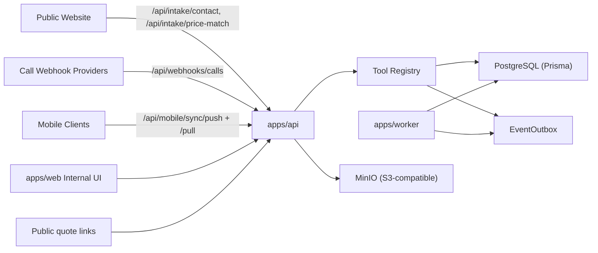

# Integrations Guide

This document is the integration contract map for MBS as implemented in this repository.

## Integration Principles

- All state-changing business operations must execute through `ToolRegistry.execute(...)`.
- API routes may authenticate, validate, and orchestrate, but domain mutation paths must remain governed.
- Every mutation must remain auditable through `ToolExecution`, `AuditLog`, and `EventOutbox`.
- Deterministic idempotency is required for replayable clients and ingestion flows.

## Integration Topology

## Auth and Access Patterns

- Internal API routes use JWT auth/role checks.
- Website intake routes use bearer token allowlist (`MBS_INGEST_TOKENS`).
- Call webhook route requires shared secret header (`CALL_WEBHOOK_SECRET`).
- Mobile uses PIN login + access/refresh tokens.
- Public quote routes are tokenized and constrained to quote-specific actions.

## Primary Integration Surfaces

### 1) Website Intake Integration

Purpose:
- Convert public contact and price-match submissions into governed CRM flows.

Ingress endpoints:
- `POST /api/intake/contact`
- `POST /api/intake/price-match`

Security:
- Bearer token from `MBS_INGEST_TOKENS`
- IP hashing with `MBS_IP_HASH_SALT`
- Intake payload persisted to `WebsiteIntakeEvent` for trace/debug

Downstream behavior:
- Lead upsert tool execution
- Attribution capture
- Timeline/task creation
- Price-match attachment reference creation where applicable

### 2) Provider-Agnostic Call Tracking Webhook

Endpoint:
- `POST /api/webhooks/calls`

Security:
- `X-Webhook-Secret` expected, backed by `CALL_WEBHOOK_SECRET`
- Rate limits + request validation

Behavior:
- Canonical payload ingestion
- Matching to lead/customer by normalized phone
- Timeline enrichment via governed tools

### 3) Mobile Offline Sync

Endpoints:
- `POST /api/mobile/sync/push`
- `POST /api/mobile/sync/pull`

Contract:
- Push contains queued actions with `clientActionId` idempotency keys.
- Pull returns delta events/read-model snapshots from cursors.
- Device-scoped cursors and action tracking tables preserve deterministic replay.

Related docs:
- `docs/MOBILE_OFFLINE_V1.md`

### 4) Media/Object Storage (MinIO/S3)

Primary endpoints:
- `POST /api/media/upload/initiate`
- `POST /api/media/upload` (also aliased by `/api/media/photos`)
- `GET /api/media/:id/file`
- `POST /api/media/:id/public`
- `DELETE /api/media/:id`
- `POST /api/admin/media/purge-expired`

Storage:
- S3-compatible adapter via `packages/storage`
- Local default target is MinIO
- Required env: `S3_ENDPOINT`, `S3_ACCESS_KEY`, `S3_SECRET_KEY`, `S3_BUCKET`, `S3_REGION`, `S3_FORCE_PATH_STYLE`

Lifecycle:
- Upload sessions are idempotent.
- Attachments support retention and purge workflows.

### 5) Scheduling and Dispatch Integration

Internal endpoints:
- `GET /api/dispatch/day`
- `POST /api/scheduling/settings`
- `POST /api/appointments/:id/assign-tech`
- `POST /api/appointments/:id/reschedule`
- `POST /api/appointments/:id/cancel`

Public booking endpoints:
- `GET /public/quotes/:token/availability`
- `POST /public/quotes/:token/book`

Behavior constraints:
- Time-block scheduling model
- Capacity lock by reservation table semantics
- Throttle toggles per service/install path

### 6) Agent Runtime + Playbooks

Endpoint:
- `POST /api/agent/playbooks/execute`

Runtime:
- Pack loader/validator/executor lives in `packages/agent-playbooks`
- Governance fail-closed behavior available for blocked/timeout governance states
- `READY` playbooks executable; `SPEC_ONLY` blocked with deterministic error contract

Related docs:
- `docs/AGENT_PLAYBOOKS.md`

### 7) Legal Pack Importer

CLI:
- `npm run legal-pack:import -- --repo <repo> --tag <tag> --pack <path>`

Implementation:
- `scripts/import-legal-pack.ts`
- `apps/api/src/legal-pack-importer.ts`

Rules:
- Deterministic request IDs
- Idempotent rerun behavior
- Schema + placeholder whitelist validation before execution
- No direct clause/template writes outside tool execution path

Related docs:
- `docs/LEGAL_PACKS_IMPORT.md`

### 8) SSE Event Stream

Endpoint:
- `GET /api/stream`

Behavior:
- DB-poll based SSE events for executions, approvals, agent runs, policy/killswitch, exposure
- Permission constrained (owner/manager-focused)

## Integration Configuration Matrix

### Core Platform

| Variable Group | Examples |
| --- | --- |
| Database/Auth | `DATABASE_URL`, `JWT_SECRET` |
| API Runtime | `PORT`, `API_JSON_BODY_LIMIT` |
| Worker | `WORKER_POLL_MS` |

### Ingestion Security

| Use | Variables |
| --- | --- |
| Website intake auth | `MBS_INGEST_TOKENS`, `MBS_IP_HASH_SALT` |
| Call webhook auth | `CALL_WEBHOOK_SECRET`, `CALL_WEBHOOK_RATE_LIMIT_*` |

### Mobile Sync

| Use | Variables |
| --- | --- |
| Token lifecycle | `MOBILE_ACCESS_TOKEN_TTL`, `MOBILE_REFRESH_TOKEN_TTL` |
| Push/Pull limits | `MOBILE_SYNC_*` |
| PIN login limits | `MOBILE_PIN_RATE_LIMIT_*` |

### Agent/Playbook Runtime Controls

| Use | Variables |
| --- | --- |
| Payload limits | `AGENT_PLAYBOOK_MAX_*` |
| Timeout/rate | `AGENT_PLAYBOOK_REQUEST_TIMEOUT_MS`, `AGENT_PLAYBOOK_RATE_LIMIT_*` |
| Inflight guards | `AGENT_PLAYBOOK_MAX_INFLIGHT_*` |

### Storage/Media

| Use | Variables |
| --- | --- |
| MinIO/S3 | `S3_*`, `MINIO_*` |
| Media lifecycle | `MEDIA_UPLOAD_*`, `MEDIA_PURGE_*` |

### Health/Hardening

| Use | Variables |
| --- | --- |
| Alerting/snapshots | `HEALTH_*`, `ERROR_TELEMETRY_WEBHOOK_URL`, `HEALTH_ALERT_WEBHOOK_URL` |
| Backups/load checks | `BACKUP_*`, `HEALTH_LOAD_SMOKE_*`, `HEALTH_MAX_*` |

## Endpoint Inventory Snapshot

The API currently exposes integration-relevant endpoints in these major groups:

- Auth and identity (`/api/me`, mobile auth endpoints)
- Tool execution and explain
- Intake and lead care
- Pricing (service/install)
- Quotes/public acceptance and booking
- Scheduling/dispatch
- Media/attachments
- Agent runs/graph/playbooks
- Governance, approvals, system health/readiness
- Accounting/review/referral and imports

Source of truth:
- `apps/api/src/index.ts`

## Verification Checklist (Integration Health)

1. `docker compose up -d --build` succeeds.
2. API health endpoint responds: `GET /health`.
3. Website intake bearer token is configured and accepted.
4. MinIO bucket is reachable and media upload works.
5. Mobile push/pull accepts and replays idempotently.
6. Tool execution logs are visible at `/api/tools/executions`.
7. Outbox processing by worker is healthy.
8. System readiness endpoint is green for intended mode:
   - `GET /api/system/readiness?mode=strict`
   - `GET /api/system/readiness?mode=critical`

## Change Control Guidance

- Add integrations by introducing new API endpoints that call governed tools.
- Keep provider-specific logic in connector/storage adapters, not in core domain handlers.
- Add idempotency fields and deterministic request ID derivation before enabling retries.
- Extend docs in this file when adding new external integrations.
